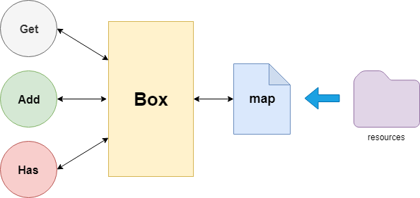
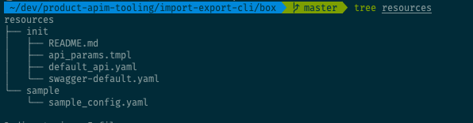
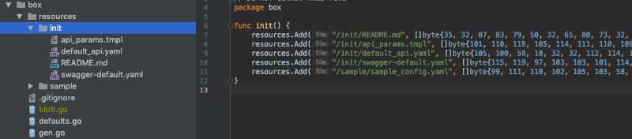

During my internship period at [WSO2, Inc](https://wso2.com) I worked on a project to develop a CI/CD pipeline for WSO2 API Manager. The tooling was mostly done in Golang.

When we were developing the tooling we wanted to have a project initialization phase through the CLI tool. That indeed involves a lot of code generation.

In the beginning, everything was fine, we had few files and we kept them as slices of bytes and accessed them, which was totally fine.

```go
// define default values, other resources in default package
package defaults
var ConfigTemplate = []byte(`
  // content goes here
`)

// In some another package
func somefunc(){
  ioutil.WriteFile("/path/to/dest", defaults.ConfigTemplate, os.ModePerm)
}
```

### Nightmare of backticks \`\`\`\`\`

The project was scaling up and content we wanted to store was growing too. It was very hard to manage these contents as they were basically in Go packages and had to manually edit them each and every time.

One day _I wanted to use Markdown for our **README** file_ which generated by the tool in the initialization phase of a project, we were generating a simple Text file until then.

**Markdown uses backticks for code blocks** and **Go uses backticks for Raw Strings**, _I could not find a better way to escape them_. It was a total disaster !.

We can’t ship these files separately as this was focused to be a small CLI tool, so I kept looking methods to embed resources into Go.

### Existing Solutions

Yes, there are existing solutions for the exact problem like [Go.rice](https://github.com/GeertJohan/go.rice) But for my task, I thought they are more complex and bloated. All I wanted to do is convert my resources into Go files and access them.

### Go generate for rescue

Go is awesome, it comes batteries included. The language is capable of code generation by default. So why not using it. If you are not familiar with what go generate is read the official [blog](https://blog.golang.org/generate). Go generate uses a special magic string to identify files that need to be generated

```go
//go:generate <command> <args>
```

When you execute `go generate filename.go` the compiler will check for the magic string and executes the command provided. `go generate ./...` will run the command through an entire project looking for files with magic string and executing the command you provided.

> Go generate runs the given command relative to the directory containing the file with magic string.

<!-- seperate -->
> Since we need to make our code generation universal, why shouldn’t we use go itself for code generation?

### The Setup



My main requirement was to storing files as bytes and accessing them in my go files. To fulfil the same requirement I created a package called `box`. It was acting as a **proxy** between consumers and data source. We store our all files inside a special directory called resources inside the box package. It can contain directories as well to organize content.



> This makes editing content much more easier and much more clean as they are just files in the system.

```go
//go:generate go run gen.go

package box

type resourceBox struct {
	storage map[string][]byte
}

func newResourceBox() *resourceBox {
	return &resourceBox{storage: make(map[string][]byte)}
}

// Find a file
func (r *resourceBox) Has(file string) bool {
	if _, ok := r.storage[file]; ok {
		return true
	}
	return false
}

// Get file's content
func (r *resourceBox) Get(file string) ([]byte, bool) {
	if f, ok := r.storage[file]; ok {
		return f, ok
	}
	return nil, false
}

// Add a file to box
func (r *resourceBox) Add(file string, content []byte) {
	r.storage[file] = content
}

// Resource expose
var resources = newResourceBox()

// Get a file from box
func Get(file string) ([]byte, bool) {
	return resources.Get(file)
}

// Add a file content to box
func Add(file string, content []byte) {
	resources.Add(file, content)
}

// Has a file in box
func Has(file string) bool {
	return resources.Has(file)
}

```

This is a very simple go file, all it does is wrapping our map inside a nice `ResourceBox` exposing all methods at package level so you can invoke them using `box.Get('filename')` in anywhere, super cool.

The `resource` object plays a key role in the package acting as the singleton to hold all the resources for our box.

Now here is the magic, it has a special comment with `//go:generate go run gen.go` , This is where magic is happening.

When you are invoking `go generate ./…` this file will be detected and it will run another go program.

### Generator

Now the fun part, we want to read our resource directory and store the content of files in a `ResourceBox`. For that we are running another go file called `gen.go` which is in the same `package box` .

As I described above, the go generate is smart enough to run the given program relative to the directory it found the magic string, so `go run gen.go` would run inside the box directory. It means we can easily read all the files in the resources directory without a problem.

We are going to create a file called `blob.go` with all the content we need inside the same package.

Since gen.go is a program we need to tell go that this is not a part of our build. Otherwise, it will complain about declaring multiple packages in the same directory.

So just add,

```go
//+build ignore
```

on the top of the file to inform the compiler to ignore this on the build. So it won’t complain.

Now we need to walk through all the files in the resources directory and convert them to go files.

```go
resources := make(map[string][]byte)
err := filepath.Walk("resources", func(path string, info os.FileInfo, err error) error {
		if err != nil {
			log.Println("Error :", err)
			return err
		}
		relativePath := filepath.ToSlash(strings.TrimPrefix(path, "resources"))
		if info.IsDir() {
			log.Println(path, "is a directory, skipping...")
			return nil
		} else {
			log.Println(path, "is a file, baking in...")
			b, err := ioutil.ReadFile(path)
			if err != nil {
				log.Printf("Error reading %s: %s", path, err)
				return err
			}
			resources[relativePath] = b
		}
		return nil
	})

	if err != nil {
		log.Fatal("Error walking through resources directory:",err)
	}
```

A part of `gen.go` which walks the file tree and reading each file and storing them

Go provides a nice way to handle this using `filepath.Walk` method. We are simply iterating all the files inside the resources directory(including all the **subdirectories as well**) and storing them in a map called resources. We are going to access files using the relative path to the resources directory.

For example to access a file in _resources/init/sample.yaml_ we can use `box.Get('/init/sample.yaml')` in a very intuitive way. But what if we run the generation in a Windows machine?

To overcome this we are going to use a feature called `ToSlash` in the `filepath` package, which will transform the platform native path separator to a slash.

```go
filepath.ToSlash(strings.TrimPrefix(path, "resources"))
```

Next, we need to create `blob.go` with all the data we have, we just need to add all the data to the resources object in the box package.

We just simply need to call `resources.Add('/file/path', data)` , what we can do is putting this in the `init()` method on the blob.go which will be initialized for the whole package at once.

```go
package box  
  
func init() {  
   resources.Add("/init/README.md", []byte{50, 70, 80, })  
   resources.Add("/init/api_params.tmpl", []byte{100, 110, 125,})  
   ...  
}
```

To do this we simply use Go Templates as following,

```go
var packageTemplate = template.Must(template.New("").Funcs(map[string]interface{}{"conv": FormatByteSlice}).Parse(`// Code generated by go generate; DO NOT EDIT.
// generated using files from resources directory
// DO NOT COMMIT this file
package box

func init(){
	{{- range $name, $file := . }}
    	resources.Add("{{ $name }}", []byte{ {{ conv $file }} })
	{{- end }}
}
`))
```

It simply iterates and creates the actual file containing the name and data for the file, later we will write this to the disk allowing access within the code.

You can see there is a function map passed to the template engine. I used this to create the byte representation of the slice as a string and use it within the template. It’s a very simple function as follows. It takes a slice of byte and returns a comma-separated value string containing all the bytes as numbers.

```go
func FormatByteSlice(sl []byte) string {
	builder := strings.Builder{}
	for _, v := range sl {
		builder.WriteString(fmt.Sprintf("%d,", int(v)))
	}
	return builder.String()
}
```

> If you had any back-tick now they all have been converted to some numbers, so no worries

Now we write the file to the disk and we are ready to Go

### But wait, my linters are failing

This is because the code is not properly formatted, you can do it yourself after generation.

Nope, we are not gonna do that, Go itself provides the formatter for formatting any go code, we can just invoke it before saving the file to the disk

```go
data, err := format.Source(builder.Bytes())  
if err != nil {  
	log.Fatal("Error formatting generated code", err)  
}
```

Simple as that.

Source:

```go
//+build ignore

package main

import (
	"bytes"
	"fmt"
	"go/format"
	"io/ioutil"
	"log"
	"os"
	"path/filepath"
	"strings"
	"text/template"
)

const blob = "blob.go"

var packageTemplate = template.Must(template.New("").Funcs(map[string]interface{}{"conv": FormatByteSlice}).Parse(`// Code generated by go generate; DO NOT EDIT.
// generated using files from resources directory
// DO NOT COMMIT this file
package box

func init(){
	{{- range $name, $file := . }}
    	resources.Add("{{ $name }}", []byte{ {{ conv $file }} })
	{{- end }}
}
`))

func FormatByteSlice(sl []byte) string {
	builder := strings.Builder{}
	for _, v := range sl {
		builder.WriteString(fmt.Sprintf("%d,", int(v)))
	}
	return builder.String()
}

func main() {
	log.Println("Baking resources... \U0001F4E6")

	if _, err := os.Stat("resources"); os.IsNotExist(err) {
		log.Fatal("Resources directory does not exists")
	}

	resources := make(map[string][]byte)
	err := filepath.Walk("resources", func(path string, info os.FileInfo, err error) error {
		if err != nil {
			log.Println("Error :", err)
			return err
		}
		relativePath := filepath.ToSlash(strings.TrimPrefix(path, "resources"))
		if info.IsDir() {
			log.Println(path, "is a directory, skipping... \U0001F47B")
			return nil
		} else {
			log.Println(path, "is a file, baking in... \U0001F31F")
			b, err := ioutil.ReadFile(path)
			if err != nil {
				log.Printf("Error reading %s: %s", path, err)
				return err
			}
			resources[relativePath] = b
		}
		return nil
	})

	if err != nil {
		log.Fatal("Error walking through resources directory:",err)
	}

	f, err := os.Create(blob)
	if err != nil {
		log.Fatal("Error creating blob file:", err)
	}
	defer f.Close()

	builder := &bytes.Buffer{}

	err = packageTemplate.Execute(builder, resources)
	if err != nil {
		log.Fatal("Error executing template", err)
	}

	data, err := format.Source(builder.Bytes())
	if err != nil {
		log.Fatal("Error formatting generated code", err)
	}
	err= ioutil.WriteFile(blob, data, os.ModePerm)
	if err != nil {
		log.Fatal("Error writing blob file", err)
	}

	log.Println("Baking resources done... \U0001F680")
	log.Println("DO NOT COMMIT box/blob.go \U0001F47B")
}
```

### Run it

Now just run `go generate ./…` within your application and you can find a file called `box/blob.go` , it will contain all the data for resources in your `box/resources` directory.



Now all you have to do is invoking `box.Get('/sample/sample_config.yaml')` to get the data from your file. Now it is embedded in your Go binary.

### Wrap Up

There were many existing solutions out there for solving this problem of embedding with advanced features. But I wanted to implement a simple solution for solving the problem we had.

Go is a powerful language which has many features that every programmer wants in their tool belt. It has templates, code generation and many more within the standard library.

This solution separates content from the code and makes them intuitive and more easy to manage.

For example, if a content writer wanted to correct some issues in your README file they can simply edit that file and build the program without thinking of the implementation. This is a win/win for both parties.

Code for the entire project: [**wso2/product-apim-tooling**](https://github.com/wso2/product-apim-tooling)
