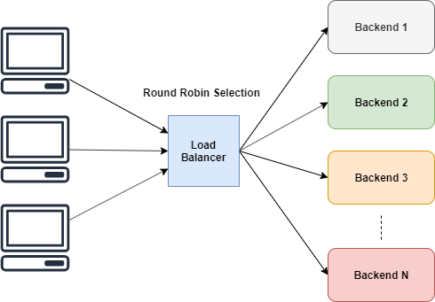
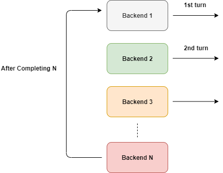
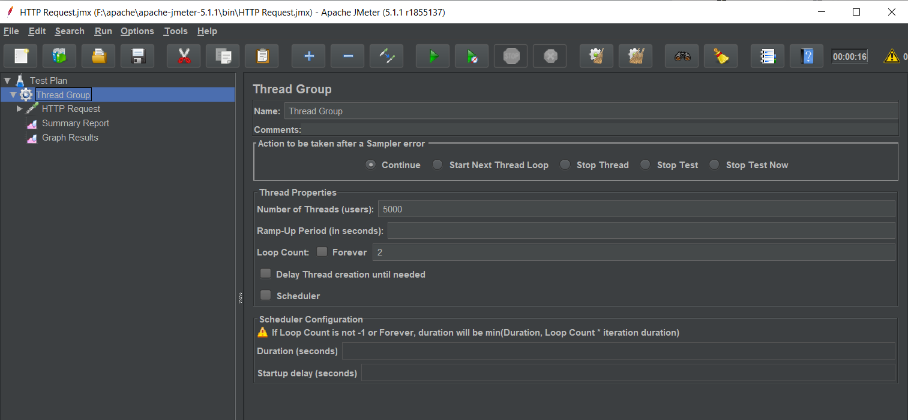
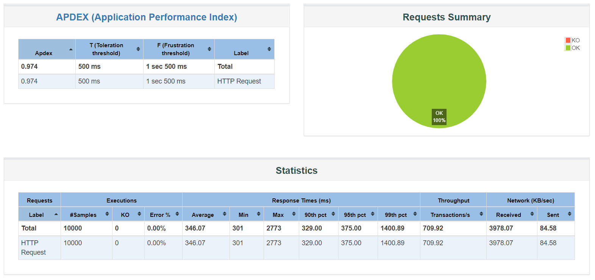

Load Balancers plays a key role in Web Architecture. They allow distributing load among a set of backends. This makes services more scalable.
Also since there are multiple backends configured the service become highly available as load balancer can pick up a working server in case of a failure.

After playing with professional Load Balancers like [NGINX](https://www.nginx.com/) I tried creating a simple Load Balancer for fun.
I implemented it using [Golang](https://golang.org/). Go is a modern language which supports concurrency as a first-class citizen.
Go has a rich standard library which allows writing high-performance applications with fewer lines of codes. It also produces a statically linked single binary for easy distributions.

## How does our simple load balancer work

Load Balancers have different strategies for distributing the load across a set of backends.

For example,

- **Round Robin** - Distribute load equally, assumes all backends have the same processing power
- **Weighted Round Robin** - Additional weights can be given considering the backend's processing power
- **Least Connections** - Load is distributed to the servers with least active connections

For our simple load balancer, we would try implementing the simplest one among these methods, **Round Robin**.



## Round Robin Selection

Round Robin is simple in terms. It gives equal opportunities for workers to perform tasks in turns.



As shown in the figure about this happens cyclically. But we can't *directly* use that aren't we?

**What if a backend is down?** We probably don't want to route traffic there. 
So this cannot be directly used unless we put some conditions on it. We need to **route traffic only to backends which are up and running**.

## Lets define some structs

After revising the plan, we know now we want a way to track all the details about a Backend. 
We need to track whether it's alive or dead and also keep track of the Url as well.

We can simply define a struct like this to hold our backends.

```go
type Backend struct {
  URL          *url.URL
  Alive        bool
  mux          sync.RWMutex
  ReverseProxy *httputil.ReverseProxy
}
```

Don't worry **I will reason about the fields in the `Backend`**.

Now we need a way to track all the backends in our load balancer, for that we can simply use a Slice. And also a counter variable. 
We can define it as **`ServerPool`**

```go
type ServerPool struct {
  backends []*Backend
  current  uint64
}
```

## Use of the ReverseProxy

As we already identified, the sole purpose of the load balancer is to route traffic to different backends and return the results to the original client.

According to Go's documentation,

> ReverseProxy is an HTTP Handler that takes an incoming request and sends it to another server, proxying the response back to the client.

**Which is exactly what we want**. There is no need to reinvent the wheel. We can simply relay our original requests through the `ReverseProxy`.

```go
u, _ := url.Parse("http://localhost:8080")
rp := httputil.NewSingleHostReverseProxy(u)
  
// initialize your server and add this as handler
http.HandlerFunc(rp.ServeHTTP)
```

With `httputil.NewSingleHostReverseProxy(url)` we can initialize a reverse proxy which would relay requests to the passed `url`. In the above example, all the requests are now passed to localhost:8080 and the results are sent back to the original client. You can find more examples here.

If we take a look at ServeHTTP method signature, it has the signature of an HTTP handler, that's why we could pass it to the `HandlerFunc` in `http`.

You can find more examples in [docs](https://golang.org/pkg/net/http/httputil/#ReverseProxy).

For our simple load balancer we could initiate the `ReverseProxy` with the associated `URL` in the `Backend`, so that `ReverseProxy` will route our
requests to the `URL`.

## Selection Process

We need to **skip dead backends** during the next pick. But to do anything we need a way to count.

Multiple clients will connect to the load balancer and when each of them requests a next peer to pass the traffic on race conditions could occur.
To prevent it we could lock the `ServerPool` with a `mutex`. But that would be an overkill, besides we don't want to lock the ServerPool at all.
We just want to increase the counter by one

To meet that requirement, the ideal solution is to make this increment atomically. And Go supports that well via `atomic` package.

```go
func (s *ServerPool) NextIndex() int {
  return int(atomic.AddUint64(&s.current, uint64(1)) % uint64(len(s.backends)))
}
```

In here, we are increasing the current value by one atomically and returns the index by modding with the length of the slice.
Which means the value always will be between 0 and length of the slice. In the end, we are interested in a particular index, not the total count.

## Picking up an alive backend.

We already know that our requests are routed in a cycle for each backend. All we have to skip dead ones, that's it.

`GetNext()` always return a value that's capped between 0 and the length of the slice. At any point, we get a next peer and if it's not alive we would have to search through the slice in a cycle.


As shown in the figure above, we want to traverse from next to the entire list, which can be done simply by traversing `next + length`
But to pick an index, we want to cap it between slice length. It can be easily done with modding operation.

After we find a working backend through the search, we mark it as the current one.

Below you can see the code for the above operation.

```go
// GetNextPeer returns next active peer to take a connection
func (s *ServerPool) GetNextPeer() *Backend {
  // loop entire backends to find out an Alive backend
  next := s.NextIndex()
  l := len(s.backends) + next // start from next and move a full cycle
  for i := next; i < l; i++ {
    idx := i % len(s.backends) // take an index by modding with length
    // if we have an alive backend, use it and store if its not the original one
    if s.backends[idx].IsAlive() {
      if i != next {
        atomic.StoreUint64(&s.current, uint64(idx)) // mark the current one
      }
      return s.backends[idx]
    }
  }
  return nil
}
```

## Avoid Race Conditions in Backend struct

There is a serious issue we need to consider. Our `Backend` structure has a variable which could be 
modified or accessed by different goroutines same time.

We know there would be more goroutines reading from this rather than writing to it.
So we have picked `RWMutex` to serialize the access to the `Alive`.

```go
// SetAlive for this backend
func (b *Backend) SetAlive(alive bool) {
  b.mux.Lock()
  b.Alive = alive
  b.mux.Unlock()
}

// IsAlive returns true when backend is alive
func (b *Backend) IsAlive() (alive bool) {
  b.mux.RLock()
  alive = b.Alive
  b.mux.RUnlock()
  return
}
```

## Lets load balance requests

With all the background we created, we can formulate the following simple method to load balance our requests.
It will only fail when our all backends are offline.

```go
// lb load balances the incoming request
func lb(w http.ResponseWriter, r *http.Request) {
  peer := serverPool.GetNextPeer()
  if peer != nil {
    peer.ReverseProxy.ServeHTTP(w, r)
    return
  }
  http.Error(w, "Service not available", http.StatusServiceUnavailable)
}
```

This method can be simply passed as a `HandlerFunc` to the http server.

```go
server := http.Server{
  Addr:    fmt.Sprintf(":%d", port),
  Handler: http.HandlerFunc(lb),
}
```

## Route traffic only to healthy backends

Our current `lb` has a serious issue. We don't know if a backend is healthy or not. To know this we have to try out a backend and check whether it is alive.

We can do this in two ways,

- **Active**: While performing the current request, we find the selected backend is unresponsive, mark it as down.
- **Passive**: We can ping backends on fixed intervals and check status

## Actively checking for healthy backends

`ReverseProxy` triggers a callback function, `ErrorHandler` on any error. We can use that to detect any failure. Here is the implementation

```go
proxy.ErrorHandler = func(writer http.ResponseWriter, request *http.Request, e error) {
  log.Printf("[%s] %s\n", serverUrl.Host, e.Error())
  retries := GetRetryFromContext(request)
  if retries < 3 {
    select {
      case <-time.After(10 * time.Millisecond):
        ctx := context.WithValue(request.Context(), Retry, retries+1)
        proxy.ServeHTTP(writer, request.WithContext(ctx))
      }
      return
    }

  // after 3 retries, mark this backend as down
  serverPool.MarkBackendStatus(serverUrl, false)

  // if the same request routing for few attempts with different backends, increase the count
  attempts := GetAttemptsFromContext(request)
  log.Printf("%s(%s) Attempting retry %d\n", request.RemoteAddr, request.URL.Path, attempts)
  ctx := context.WithValue(request.Context(), Attempts, attempts+1)
  lb(writer, request.WithContext(ctx))
}
```

In here we leverage the power of closures to design this error handler. It allows us to capture outer variables like server url into our method.
It will check for existing retry count and if it is less than 3, we again send the same request to the same backend.
The reason behind this is due to temporary errors the server may reject your requests and it may be available after a short delay(possibly the server ran out of sockets to accept more clients). So we have put a timer to delay the retry for around 10 milliseconds. We increases the retry count with every request.

After every retry failed, we mark this backend as down.

Next thing we want to do is attempting a new backend to the same request. We do it by keeping a count of the attempts using the context package. After increasing the attempt count, we pass it back to `lb` to pick a new peer to process the request.

Now we can't do this indefinitely, thus we need to check from `lb` whether the maximum attempts already taken before processing the request further.

We can simply get the attempt count from the request and if it has exceeded the max count, eliminate the request.

```go
// lb load balances the incoming request
func lb(w http.ResponseWriter, r *http.Request) {
  attempts := GetAttemptsFromContext(r)
  if attempts > 3 {
    log.Printf("%s(%s) Max attempts reached, terminating\n", r.RemoteAddr, r.URL.Path)
    http.Error(w, "Service not available", http.StatusServiceUnavailable)
    return
  }

  peer := serverPool.GetNextPeer()
  if peer != nil {
    peer.ReverseProxy.ServeHTTP(w, r)
    return
  }
  http.Error(w, "Service not available", http.StatusServiceUnavailable)
}
```

This implementation is recursive.

## Use of context

`context` package allows you to store useful data in an Http request. 
We heavily utilized this to track request specific data such as Attempt count and Retry count.

First, we need to specify keys for the context. It is recommended to use non-colliding integer keys rather than strings. Go provides `iota` keyword to implement constants incrementally, each containing a unique value. That is a perfect solution defining integer keys.

```go
const (
  Attempts int = iota
  Retry
)
```

Then we can retrieve the value as usually we do with a HashMap like follows. The default return value may depend on the use case.

```go
// GetAttemptsFromContext returns the attempts for request
func GetRetryFromContext(r *http.Request) int {
  if retry, ok := r.Context().Value(Retry).(int); ok {
    return retry
  }
  return 0
}
```

## Passive health checks

Passive health checks allow to recover dead backends or identify them. We ping the backends with fixed intervals to check their status.

To ping, we try to establish a TCP connection. If the backend responses, we mark it as alive. This method can be changed to call a specific endpoint like `/status` if you like. Make sure to close the connection once it established to reduce the additional load in the server.
Otherwise, it will try to maintain the connection and it would run out of resources eventually.

```go
// isAlive checks whether a backend is Alive by establishing a TCP connection
func isBackendAlive(u *url.URL) bool {
  timeout := 2 * time.Second
  conn, err := net.DialTimeout("tcp", u.Host, timeout)
  if err != nil {
    log.Println("Site unreachable, error: ", err)
    return false
  }
  _ = conn.Close() // close it, we dont need to maintain this connection
  return true
}
```

Now we can iterate the servers and mark their status like follows,

```go
// HealthCheck pings the backends and update the status
func (s *ServerPool) HealthCheck() {
  for _, b := range s.backends {
    status := "up"
    alive := isBackendAlive(b.URL)
    b.SetAlive(alive)
    if !alive {
      status = "down"
    }
    log.Printf("%s [%s]\n", b.URL, status)
  }
}
```

To run this periodically we can start a timer in Go. Once a timer created it allows you to listen for the event using a channel.

```go
// healthCheck runs a routine for check status of the backends every 20 secs
func healthCheck() {
  t := time.NewTicker(time.Second * 20)
  for {
    select {
    case <-t.C:
      log.Println("Starting health check...")
      serverPool.HealthCheck()
      log.Println("Health check completed")
    }
  }
}
```

In the above snippet, `<-t.C` channel will return a value per 20s. `select` allows to detect this event. `select` waits until at least one case statement could be executed if there is no `default` case.

Finally, run this in a separate goroutine.

```go
go healthCheck()
```

<!-- ## A little benchmark

After implementing the load balancer, I tried benchmarking on my working machine. This may not be ideal as we
want dedicated instances to do an actual load testing.

My specs are Core i7, 16GiB Ram, Windows 10 Education.

Test was carried out using Apache JMeter with 5000 concurrent users, 2 loops total 10000 requests.





We get around 700 Transactions per second for our simple load balancer, which is not bad at all. -->

## Conclusion

We covered a lot of stuff in this article.

- Round Robin Selection
- ReverseProxy from the standard library
- Mutexes
- Atomic Operations
- Closures
- Callbacks
- Select Operation

There is a lot we can do to improve our tiny load balancer.

For example,

- Use a heap for sort out alive backends to reduce search surface
- Collect statistics
- Implement weighted round-robin/least connections
- Add support for a configuration file

etc.

You can find the source code to repository [here](https://github.com/kasvith/simplelb/).

Thank you for reading this article :smile:
