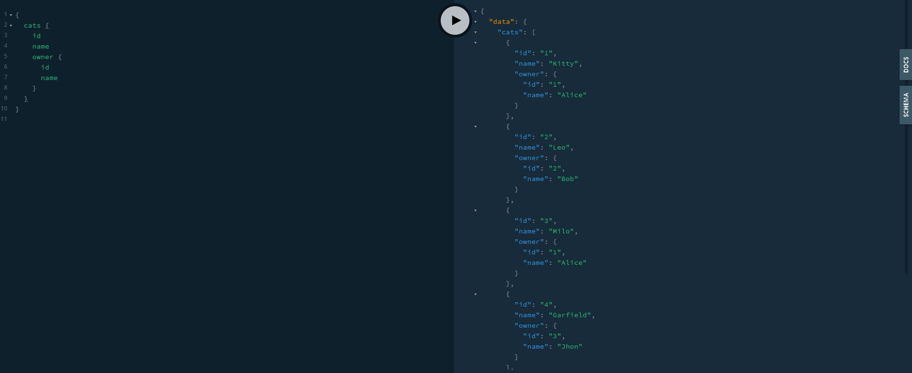

<!--article-->
NestJS is a powerful framework to develop server-side applications. With GraphQL support, it is easy to create scalable services easily with NestJS. Dataloader plays a crucial part in developing high perfomance GraphQL services. It eliminates the N+1 problem allowing services to be more responsive. In this small article, we will discuss how I integrated Dataloader into a NestJS application.

## NestJS and GraphQL :sparkles:

I used [NestJS](https://nestjs.com/) for one of my recent projects. NestJS provides a scalable architecture for building complex projects. It is also platform agnostic, you can use Express or Fastify under the hood without a problem. This is not limited to just monolithic services. It supports Microservices out of the box as well. One of the key features in NestJS is the powerful Dependency Injection(DI) pattern which allows developers to maintain a clean codebase.

[GraphQL](https://graphql.org/) is a query language for APIs. Instead of settling into specific API endpoints like in RESTful architecture, you can expose data and relations, then query them as you need. This makes GraphQL flexible enough to handle multiple client types like Mobile/Web or handle the requirements of multiple teams easily.

GraphQL plays nicely with Nest. Thanks to platform-agnostic architecture we can easily plug a GraphQL layer into a Nest application. Nest provides two methods to develop your GraphQL layer. Schema First and Code First. I prefer the code-first approach. You can read about GraphQL integration [here](https://docs.nestjs.com/graphql/quick-start).

## What is Dataloader :rocket:

If you have used GraphQL before, you might probably have heard of the **N+1 problem**. 

GraphQL uses atomic resolvers to resolve your data independently. It might call the underlying service more often to fetch the *same data* during one query/mutation.

Dataloader was introduced to solve this problem. It might look like a BlackBox at first. But it's a simple memoized cache with a limited lifetime. 
When someone requests data, the Dataloader will attempt to find it in the cache or load it from the data source.
To learn more I recommend reading the [following article by Marc-André Giroux](https://xuorig.medium.com/the-graphql-dataloader-pattern-visualized-3064a00f319f).

## Before move on :rotating_light:

I assume that you have used NestJS and know the fundamentals. If not please follow the [official guide](https://docs.nestjs.com/first-steps) and go through it. If you don't know GraphQL this is not a tutorial where I explain everything. Nest has an amazing approach to GraphQL, please follow [this guide to learn](https://docs.nestjs.com/graphql/quick-start).

You can find the source [here](https://github.com/kasvith/nestjs-dataloader-example).

## Let's define the schema :hammer:

Imagine a GraphQL schema like follows. In here a `Cat` has an `Owner`. 

```graphql
type Owner {
  # ID of the owner
  id: ID!

  # Name of the owner
  name: String!
}

type Cat {
  # ID of the cat
  id: ID!

  # Name of the cat
  name: String!

  # What this cat likes
  likes: String!

  # Owner of the cat
  owner: Owner
}
```

Let's define this with Code First approach in Nest.

```ts
@ObjectType()
export class Cat implements ICat {
  @Field(() => ID, { description: 'ID of the cat' })
  id: number;

  @Field(() => String, { description: 'Name of the cat' })
  name: string;

  @Field(() => String, { description: 'What this cat likes' })
  likes?: string;

  // we dont expose the ownerId in the schema
  // instead lets expose it via a field resolver
  @HideField()
  ownerId: number;
}
```

Now let's define our resolver to handle this. As you can see we are not exposing `ownerId` to the GraphQL layer.
Instead, we will use a field resolver to resolve it when requested.

In REST we would probably have used a `JOIN` to eager load the relation when requesting the `Cat`. With GraphQL we can load the `Owner` only if it is requested by the client.

Resolver code would be like follows

```ts
@Resolver(() => Cat)
export class CatsResolver {
  constructor(
    private readonly catsService: CatsService,
    private readonly ownersService: OwnersService,
  ) {}

  @ResolveField(() => Owner, {
    name: 'owner',
    description: 'Owner of the cat',
    nullable: true,
  })
  getOwner(@Parent() cat: Cat) {
    return this.ownersService.findOwnerById(cat.ownerId);
  }

  @Query(() => [Cat], {
    name: 'cats',
    description: 'Loads all cats',
    nullable: 'itemsAndList',
  })
  getCats(): Cat[] {
    return this.catsService.allCats();
  }
}
```

In here `ResolveField` will resolve the value for us using the `ownerService`. `@Parent` decorator is used to get the parent object of the query.
In our case it is the `Cat` which contains the `ownerId`.

Let's fetch cats with owners



If we take a look at database logs, we can see that it is loading the same item multiple times within a single query.

```bash
loading all cats
loading owner 1
loading owner 2
loading owner 1
loading owner 3
loading owner 1
```

**This is because multiple cats have the same owner**. GraphQL doesn't know it has already loaded the same user.
Let's add Dataloader and fix this :rocket:.

## Adding Dataloader :fire:

Add Dataloader to the project by running

```bash
npm install --save dataloader
```

Dataloader doesn't know how to fetch data from a source. We need to provide a batch function to `dataloader` so it can load items from the data source.  

### Dataloader module

We will
