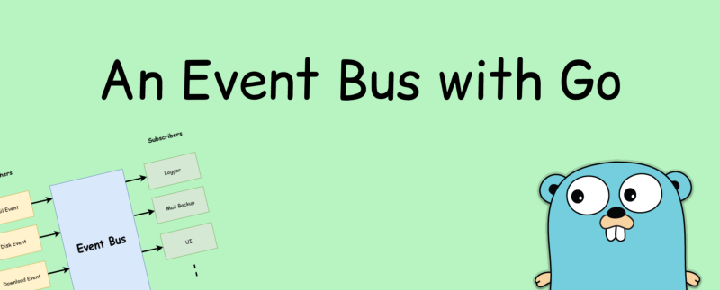
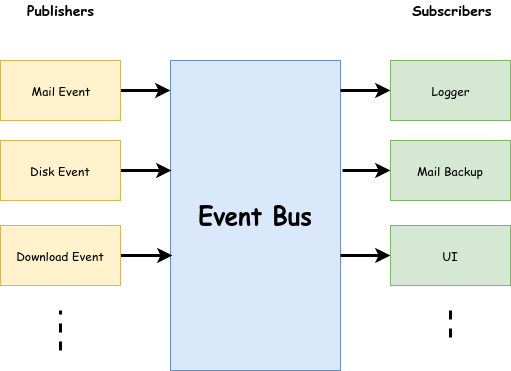

Event Driven architecture is a highly-scalable paradigm in computer science. It allows us to asynchronously process events by multiple parties.

An Event Bus is an implementation of the [pub/sub pattern](https://en.wikipedia.org/wiki/Publish%E2%80%93subscribe_pattern) where publishers are publishing data and interested subscribers can listen to them and act based on data. This allows loose coupling of publishers from subscribers. Publishers publish data events to the event bus, and the bus is responsible for delivering them to subscribers.

An event bus

The traditional approach to implementing an event bus involves using callbacks. Subscribers usually implement an interface and then the event bus propagates data via the interface.

With go’s concurrency model we know that channels can be used in most places to replace callbacks. In this article, we focus on how to use channels for implementing an event bus.

> We focus on **topic based events**. Publishers publish to topics and subscribers can listen to them.

### Defining data structures

For this task, we need to define data structures to pass around. We can simply create a new data type using a `struct`. Let’s define a `DataEvent` struct as follows:

**type** DataEvent **struct** {  
   Data **interface**{}  
   Topic string  
}

In here we have defined underlying data to be an interface which means it can be any value. We additionally have defined the topic as a member of the struct. It is possible that your subscriber could listen for **more than one topic**. So, it is a good practice that we pass the topic so that the subscriber can distinguish between events.

### Introduce channels

Now we have defined our primary data structure for the task, we need a way to pass it around. To do that, we can define a `DataChannel` which can propagate a `DataEvent`.

_// DataChannel is a channel which can accept an DataEvent  
_**type** DataChannel **chan** DataEvent

_// DataChannelSlice is a slice of DataChannels  
_**type** DataChannelSlice \[\] DataChannel

`DataChannelSlice` was created for keeping a slice of channels and to reference them easily.

### Event Bus

_// EventBus stores the information about subscribers interested for // a particular topic  
_**type** EventBus **struct** {  
   subscribers **map**\[string\]DataChannelSlice  
   rm sync.RWMutex  
}

`EventBus` has `subscribers` which is a map that holds `DataChannelSlices`. We have used a `mutex` to protect it against concurrent access from reading and writing.

By using a `map` and defining `topics`, it allows us to organize events easily. A topic is treated as a key inside the map. When someone publishes to it we can easily find the topic by key and then propagate the event to channels for further processing.

### Subscribing to a topic

For subscribing to a topic, a channel is used. It acts like the callback in the traditional approach. The channel will receive data when a publisher publishes data to the topic.

**func** (eb \*EventBus)Subscribe(topic string, ch DataChannel)  {  
   eb.rm.Lock()  
   **if** prev, found := eb.subscribers\[topic\]; found {  
      eb.subscribers\[topic\] = append(prev, ch)  
   } **else** {  
      eb.subscribers\[topic\] = append(\[\]DataChannel{}, ch)  
   }  
   eb.rm.Unlock()  
}

Simply we are appending the subscriber to the channel slice and locking the structure and unlocking it after the operation.

### Publishing to a topic

To publish an event, the publisher needs to provide the topic and the data needed to be broadcasted for the subscribers.

**func** (eb \*EventBus) Publish(topic string, data **interface**{}) {  
   eb.rm.RLock()  
   **if** chans, found := eb.subscribers\[topic\]; found {  
      _// this is done because the slices refer to same array even though they are passed by value  
      // thus we are creating a new slice with our elements thus preserve locking correctly._ channels := append(DataChannelSlice{}, chans...)  
      **go func**(data DataEvent, dataChannelSlices DataChannelSlice) {  
         **for** \_, ch := **range** dataChannelSlices {  
            ch <- data  
         }  
      }(DataEvent{Data: data, Topic: topic}, channels)  
   }  
   eb.rm.RUnlock()  
}

In this method, first we check if any subscriber exists for the topic. Then we just simply iterate through channel slice associated with the topic and publish it.

> Note that we have used a goroutine in publish method to avoid blocking the publisher

### Let’s tryout

First, we need to create an instance of the event bus. In a real scenario, you can export a single `EventBus` from the package **making it act like a singleton**.

**var** eb = &EventBus{  
   subscribers: **map**\[string\]DataChannelSlice{},  
}

To test the newly created event bus we are going to create a method which publishes to a given topic with random intervals

**func** publisTo(topic string, data string)  {  
   **for** {  
      eb.Publish(topic, data)  
      time.Sleep(time.Duration(rand.Intn(1000)) \* time.**_Millisecond_**)  
   }  
}

Next, we need a main function which can listen to the topic. It uses a helper method to printout event data.

**func** printDataEvent(ch string, data DataEvent)  {  
   fmt.Printf(**"Channel: %s; Topic: %s; DataEvent: %v\\n"**, ch, data.Topic, data.Data)  
}

**func** main()  {  
   ch1 := make(**chan** DataEvent)  
   ch2 := make(**chan** DataEvent)  
   ch3 := make(**chan** DataEvent)

   eb.Subscribe(**"topic1"**, ch1)  
   eb.Subscribe(**"topic2"**, ch2)  
   eb.Subscribe(**"topic2"**, ch3)

   **go** publisTo(**"topic1"**, **"Hi topic 1"**)  
   **go** publisTo(**"topic2"**, **"Welcome to topic 2"**)

   **for** {  
      **select** {  
      **case** d := <-ch1:  
         **go** printDataEvent(**"ch1"**, d)  
      **case** d := <-ch2:  
         **go** printDataEvent(**"ch2"**, d)  
      **case** d := <-ch3:  
         **go** printDataEvent(**"ch3"**, d)  
      }  
   }  
}

We have created three channels which can subscribe to a topic. Two of them ch2 and ch3 listens to the same event.

We have used a select statement to get data from the quickest channel. Then it uses another goroutine for printout data. This is not necessary at all. But in some cases, you have to do some heavy operation with the event. To prevent blocking the select we have used the goroutine.

Sample output will look like this

Channel: ch1; Topic: topic1; DataEvent: Hi topic 1  
Channel: ch2; Topic: topic2; DataEvent: Welcome to topic 2  
Channel: ch3; Topic: topic2; DataEvent: Welcome to topic 2  
Channel: ch3; Topic: topic2; DataEvent: Welcome to topic 2  
Channel: ch2; Topic: topic2; DataEvent: Welcome to topic 2  
Channel: ch1; Topic: topic1; DataEvent: Hi topic 1  
Channel: ch3; Topic: topic2; DataEvent: Welcome to topic 2  
...

You can see the event bus delivering the events with channels.

Source Code for the simple channel based event bus.

### Complete Code

The complete code for event bus

### Well, why use channels instead of callbacks?

The traditional callback way requires you to implement some sort of an interface.

For example,

**type** Subscriber **interface** {  
   onData(event Event)  
}

Now if you want to subscribe to an event you need to implement the interface so event bus can propagate it.

**type** MySubscriber **struct** {  
}

**func** (m MySubscriber) onData(event Event)  {  
   // do anything with event  
}

The channel approach allows you to simply register a subscriber inside a simple function without having an interface.

**func** main() {  
   ch1 := make(**chan** DataEvent)  
   eb.Subscribe(**"topic1"**, ch1)  
   fmt.Println((<-ch1).Data)  
   ...}

### Conclusion

The goal of this article was to point out a different paradigm for writing an event bus.

> This might not be the ideal solution.

For example, channels are blocked until someone consumes them. They have limitations.

> I’ve used a slice to store all the subscribers for a topic. This is used to simplifying the article. This need to be replaced with a **SET** so no duplicate entries present in the list

Traditional callback approach can be simply implemented by using the same mechanism provided. You can easily make it asynchronous wrapping publishing inside a goroutine.

I would love to hear your thoughts about the article. :)

[**Learn Go - Best Go Tutorials (2019) | gitconnected**  
_The top 23 Go tutorials - learn Go for free. Courses are submitted and voted on by developers, enabling you to find the…_gitconnected.com](https://gitconnected.com/learn/golang "https://gitconnected.com/learn/golang")